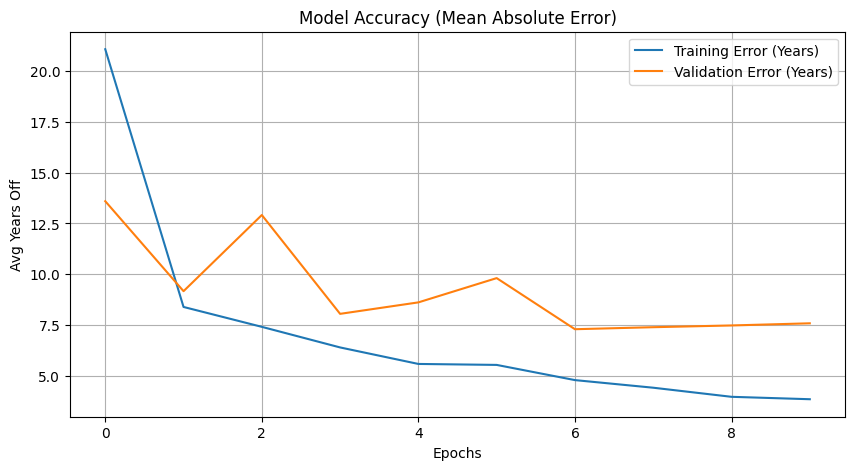

# 👤 Age Detection using ResNet-18


A Deep Learning project aimed at predicting the exact age of a person from facial images using **Transfer Learning**. The project utilizes a pre-trained **ResNet-18** architecture modified for regression tasks.

## 📄 Project Overview
This project treats age estimation as a **Regression Problem** (predicting a continuous number) rather than a classification problem. It is trained on the **UTKFace** dataset and achieves a Mean Absolute Error (MAE) of approximately **7.6 years** on the validation set.

### Key Features
* **Architecture:** ResNet-18 (Pre-trained on ImageNet).
* **Task:** Regression (Output layer modified to 1 neuron).
* **Loss Function:** Mean Squared Error (MSE).
* **Metric:** Mean Absolute Error (MAE).
* **Platform:** Google Colab (T4 GPU).

## 📂 Dataset
The project uses the **UTKFace** dataset.
* **Input:** Facial images (JPG).
* **Labels:** Extracted directly from filenames (Format: `[age]_[gender]_[race]_[date].jpg`).
* **Preprocessing:** Images resized to 224x224 and normalized using ImageNet mean/std standards.

## 📊 Results
The model was trained for 10 epochs with a batch size of 32.

| Metric | Value |
| :--- | :--- |
| **Training MAE** | ~3.86 Years |
| **Validation MAE** | ~7.59 Years |

### Learning Curve
Below is the training and validation error over 10 epochs. The validation error stabilizes, indicating the model has learned generalized features.



## 🛠️ Methodology
1.  **Data Loading:** A custom PyTorch `Dataset` class parses filenames to extract age labels.
2.  **Model Modification:** The fully connected layer (`model.fc`) of ResNet-18 was replaced:
    ```python
    model.fc = nn.Linear(num_ftrs, 1)
    ```
3.  **Training:** Utilized the Adam optimizer with a learning rate of 0.001.
4.  **Inference:** The model outputs a float value representing the predicted age.

## 🚀 How to Run
1.  **Clone the repository**
    ```bash
    git clone [https://github.com/AaryamanP/Age_Detection_Resnet18.git](https://github.com/AaryamanP/Age_Detection_Resnet18.git)
    cd Age_Detection_Resnet18
    ```

2.  **Install Dependencies**
    ```bash
    pip install -r requirements.txt
    ```

3.  **Run the Notebook**
    Open `model.ipynb` in Jupyter Notebook or Google Colab.
    * *Note: You will need to download the UTKFace dataset (archive.zip) separately and place it in the project folder.*

## 📦 Files Description
* `model.ipynb`: Complete training, validation, and visualization code.
* `age_model_resnet18.pth`: Saved model weights (state_dict).
* `learning_curve.png`: Performance graph visualization.
* `requirements.txt`: List of dependencies required to run the code.

## 👨‍💻 Author
**AaryamanP**